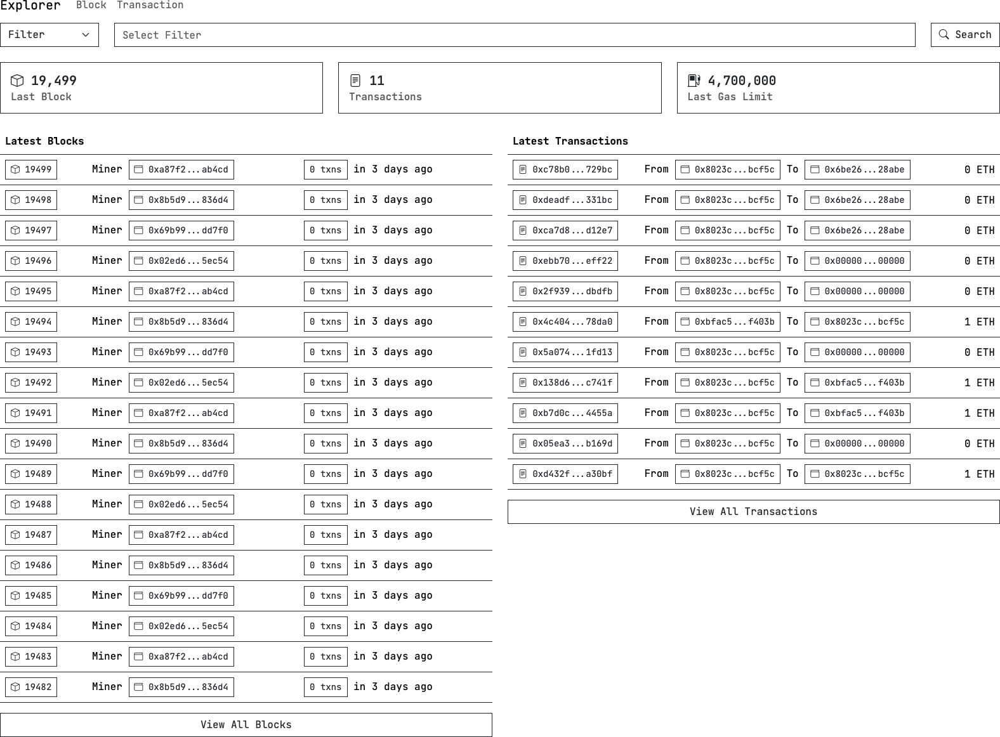

# Explorer

Blockchain Explorer for [Hyperledger Besu](https://besu.hyperledger.org) with [QBFT](https://entethalliance.github.io/client-spec/qbft_spec.html).


## Deployment instructions

### Clone repository

```shell
git clone git@github.com:web3kt/explorer.git
```

or

```shell
git clone https://github.com/web3kt/explorer.git
```

### Run

```shell
RPC_ENDPOINT=http://<rpc_endpoint> docker compose up
```
