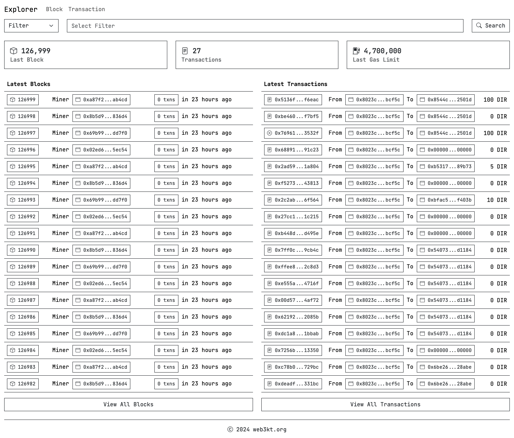

# Explorer

Blockchain Explorer for [Hyperledger Besu](https://besu.hyperledger.org).


## Deployment instructions

### Clone repository

```shell
git clone git@github.com:web3kt/explorer.git
```

or

```shell
git clone https://github.com/web3kt/explorer.git
```

### Pull docker image

```shell
cd explorer
docker compose pull
```

### Run docker compose

```shell
RPC_ENDPOINT=http://<rpc_endpoint> docker compose up
```
